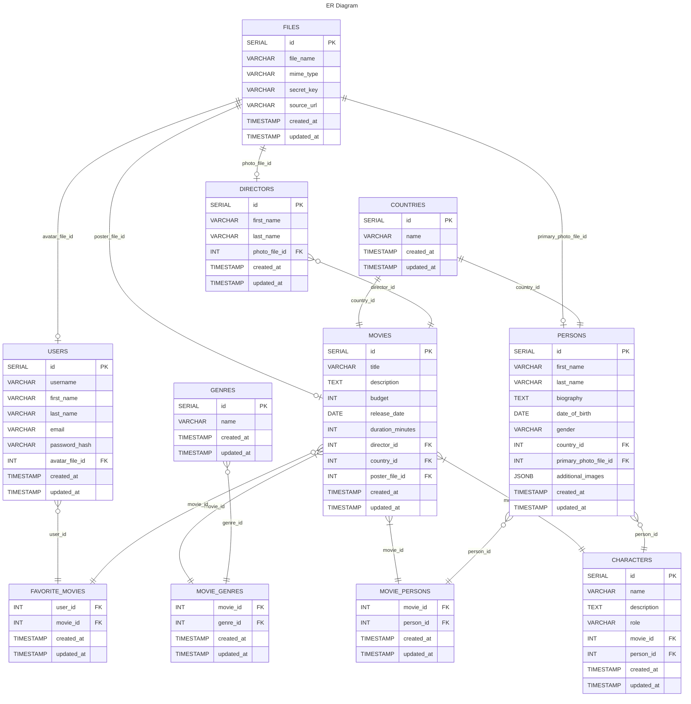

```mermaid
---
title: ER Diagram
---
erDiagram
    FILES {
        SERIAL id PK
        VARCHAR file_name
        VARCHAR mime_type
        VARCHAR secret_key
        VARCHAR source_url
        TIMESTAMP created_at
        TIMESTAMP updated_at
    }

    USERS {
        SERIAL id PK
        VARCHAR username
        VARCHAR first_name
        VARCHAR last_name
        VARCHAR email
        VARCHAR password_hash
        INT avatar_file_id FK
        TIMESTAMP created_at
        TIMESTAMP updated_at
    }

    DIRECTORS {
        SERIAL id PK
        VARCHAR first_name
        VARCHAR last_name
        INT photo_file_id FK
        TIMESTAMP created_at
        TIMESTAMP updated_at
    }

    COUNTRIES {
        SERIAL id PK
        VARCHAR name
        TIMESTAMP created_at
        TIMESTAMP updated_at
    }

    GENRES {
        SERIAL id PK
        VARCHAR name
        TIMESTAMP created_at
        TIMESTAMP updated_at
    }

    MOVIES {
        SERIAL id PK
        VARCHAR title
        TEXT description
        INT budget
        DATE release_date
        INT duration_minutes
        INT director_id FK
        INT country_id FK
        INT poster_file_id FK
        TIMESTAMP created_at
        TIMESTAMP updated_at
    }

    MOVIE_GENRES {
        INT movie_id  FK
        INT genre_id  FK
        TIMESTAMP created_at
        TIMESTAMP updated_at
    }

    PERSONS {
        SERIAL id PK
        VARCHAR first_name
        VARCHAR last_name
        TEXT biography
        DATE date_of_birth
        VARCHAR gender
        INT country_id FK
        INT primary_photo_file_id FK
        JSONB additional_images
        TIMESTAMP created_at
        TIMESTAMP updated_at
    }

    MOVIE_PERSONS {
        INT movie_id FK
        INT person_id FK
        TIMESTAMP created_at
        TIMESTAMP updated_at
    }

    CHARACTERS {
        SERIAL id PK
        VARCHAR name
        TEXT description
        VARCHAR role
        INT movie_id FK
        INT person_id FK
        TIMESTAMP created_at
        TIMESTAMP updated_at
    }

    FAVORITE_MOVIES {
        INT user_id FK
        INT movie_id FK
        TIMESTAMP created_at
        TIMESTAMP updated_at
    }

    FILES ||--o| USERS : avatar_file_id
    FILES ||--o| DIRECTORS : photo_file_id
    FILES ||--o| MOVIES : poster_file_id
    FILES ||--o| PERSONS : primary_photo_file_id
    COUNTRIES ||--|| MOVIES : country_id
    COUNTRIES ||--|| PERSONS : country_id
    DIRECTORS }o--|| MOVIES : director_id
    MOVIES }|--|| MOVIE_GENRES : movie_id
    GENRES }o--|| MOVIE_GENRES : genre_id
    MOVIES }|--|| MOVIE_PERSONS : movie_id
    PERSONS }o--|| MOVIE_PERSONS : person_id
    MOVIES }|--|| CHARACTERS : movie_id
    PERSONS }o--|| CHARACTERS : person_id
    USERS }o--|| FAVORITE_MOVIES : user_id
    MOVIES }o--|| FAVORITE_MOVIES : movie_id

```